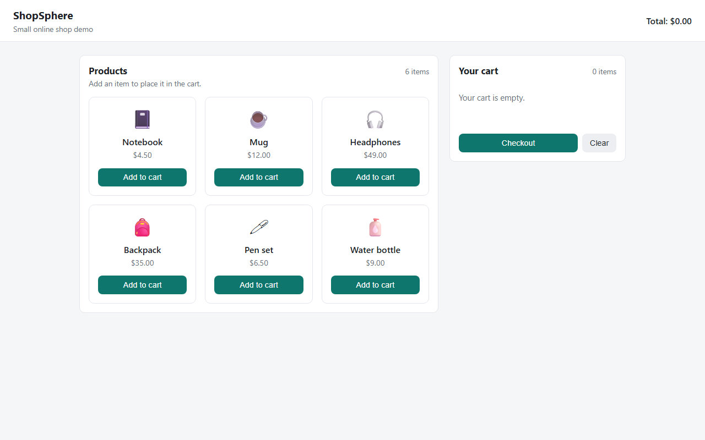
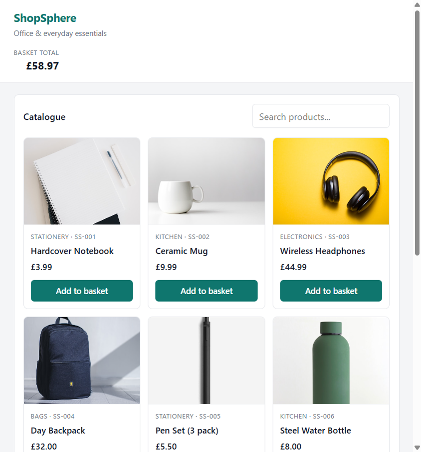

# ShopSphere

**Built:** April 2026  
**Updated:** July 2026  
**Author:** [Panashe Sanyanga](https://github.com/code-by-panashe-sanyanga)

A small online shop built with Flask. Browse products with photos, search the list, add items to a session cart, change quantities, and run through checkout. Runs locally on your machine student learning project, not a real store.

After PixelGram I wanted the basket on the server without setting up another database. Flask sessions were enough for that.

---

## What this project does

1. **Catalogue** — `GET /api/products` returns a fixed list of items (name, price in GBP, category, SKU, and image file).
2. **Search** — the frontend filters products by name, category, or SKU.
3. **Add to basket** — each “Add to basket” button sends `POST /api/cart` with `product_id`. Quantities stack if you add the same item twice.
4. **Basket panel** — `GET /api/cart` returns line items and the running total.
5. **Change quantity** — `PATCH /api/cart/item` updates quantity or removes a line when qty is 0.
6. **Clear basket** — `DELETE /api/cart` empties the session basket.
7. **Checkout** — `POST /api/checkout` calculates the total, clears the basket, and returns a thank-you message. There is no real payment.

Each browser visitor gets their own basket via a signed Flask session cookie.

---

## Why I chose each technology

| Technology | Why I used it |
|------------|---------------|
| **Flask** | Same stack as PixelGram — I could reuse patterns for serving static files and JSON routes. |
| **Flask sessions** | Good fit for a basket that belongs to one browser without user login. The basket is a dict in the session: `{ "product_id": quantity }`. |
| **In-memory `PRODUCTS` list** | The catalogue is small and static. Keeping it in `app.py` was enough for six items. |
| **Vanilla JS** | Updates the basket UI after each API call without React. |
| **Product images in `static/images/`** | Real photos look more like a proper shop than emoji placeholders. |

---

## Folder structure

```
ShopSphere/
├── app.py                 # Flask server, products, basket, checkout
├── requirements.txt       # Flask dependency
├── screenshots/
│   ├── home.png           # Catalogue view
│   └── basket.png         # Basket with items and total
├── static/
│   ├── images/            # Product photos used on the cards
│   ├── index.html         # Catalogue and basket layout
│   ├── style.css          # Shop layout and basket styles
│   └── app.js             # Load products, basket actions, checkout
├── .gitignore
└── README.md
```

---

## How to run it

### Prerequisites

- Python 3.10 or newer

### Installation

```bash
python -m venv venv
venv\Scripts\activate        # Windows
# source venv/bin/activate   # macOS/Linux

pip install -r requirements.txt
python app.py
```

Open **http://localhost:5002**

---

## Frontend files in detail

| File | What it does |
|------|----------------|
| **static/index.html** | Two-column layout: product catalogue and basket panel with total, clear button, and checkout button. |
| **static/style.css** | Product cards, image layout, basket list styling, toast messages, and responsive layout. |
| **static/app.js** | `loadProducts()` renders the grid; `addToCart(id)` POSTs to the API; `loadCart()` refreshes items and total; quantity buttons call `PATCH /api/cart/item`; checkout shows a toast instead of `alert()`. |

The browser must allow cookies — Flask sessions depend on them.

---

## Backend files in detail

| File | What it does |
|------|----------------|
| **app.py** | Defines `PRODUCTS`, sets `secret_key` for signing sessions, implements product lookup, basket GET/POST/PATCH/DELETE, and checkout. Serves static files and runs on port **5002**. |
| **requirements.txt** | Flask only — install with pip. |

### Session basket format

Internally the session stores something like:

```json
{ "1": 2, "3": 1 }
```

Keys are product IDs (strings); values are quantities. `get_cart()` expands this into full product objects plus a `total`.

### API routes

| Method | Endpoint | Description |
|--------|----------|-------------|
| `GET` | `/api/products` | List all products |
| `GET` | `/api/cart` | Basket items and total |
| `POST` | `/api/cart` | Add one item — body: `{ "product_id": 1 }` |
| `PATCH` | `/api/cart/item` | Update quantity — body: `{ "product_id": 1, "qty": 2 }` |
| `DELETE` | `/api/cart` | Clear basket |
| `POST` | `/api/checkout` | Fake order — empties basket |

### Example basket response

```json
{
  "items": [
    {
      "id": 1,
      "name": "Hardcover Notebook",
      "price": 3.99,
      "category": "Stationery",
      "sku": "SS-001",
      "image": "notebook.jpg",
      "qty": 2
    }
  ],
  "total": 7.98
}
```

---

## JSON in this project

ShopSphere does not use a `products.json` file. Products are a Python list in `app.py`.

JSON still matters because:

- Every API response is JSON the frontend parses with `res.json()`.
- `POST /api/cart` expects JSON: `{ "product_id": <number> }`.
- `PATCH /api/cart/item` expects JSON: `{ "product_id": <number>, "qty": <number> }`.

If the catalogue grew, moving products to a `products.json` file (like StreamFlix’s `movies.json`) would be a natural next step.

---

## venv — what not to upload

| Do commit | Do not commit |
|-----------|----------------|
| `app.py`, `static/`, `requirements.txt`, `screenshots/` | `venv/`, `__pycache__/`, `.pyc` files |

There is no `node_modules` folder — the frontend has no npm step.

---

## Screenshots

**Catalogue**



**Basket with items**



---

## Limitations and possible improvements

**Current limitations**

- No real payment (Stripe, PayPal, etc.).
- Basket lives in the session — clearing browser cookies loses the basket.
- Product list is hard-coded; changing stock requires editing Python.
- No user accounts, order history, or inventory counts.
- `secret_key` is a dev string in source code — not safe for production.

**Ideas for later**

- Move products to JSON or a database with an admin page.
- Persist baskets per logged-in user.
- Stock limits and “out of stock” states.
- Order confirmation emails (even mocked).
- Stripe test mode for payment flow practice.

---

## Troubleshooting

| Problem | What to try |
|---------|-------------|
| **Basket always empty after add** | Ensure cookies are enabled. Do not use incognito with strict blocking unless you stay in the same tab session. |
| **“unknown product”** | `product_id` must match an ID in the `PRODUCTS` list (1–6). |
| **“basket is empty” on checkout** | Add at least one item before checkout. |
| **Wrong port** | ShopSphere uses **5002** on purpose (PixelGram uses 5000, ChatWire 5001). |
| **Static files 404** | Run `python app.py` from the project root where `app.py` lives. |
| **`ModuleNotFoundError: flask`** | Activate `venv` and run `pip install -r requirements.txt`. |
| **Product images missing** | Check that `static/images/` is present and the filenames match the `image` field in `PRODUCTS`. |

---

## Links

- [Portfolio](https://github.com/code-by-panashe-sanyanga/PS-PORTFOLIO)
- [GitHub profile](https://github.com/code-by-panashe-sanyanga)
